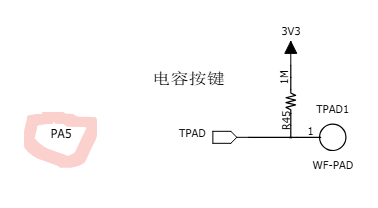
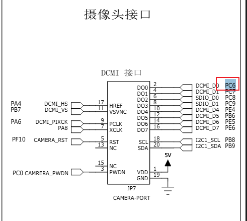
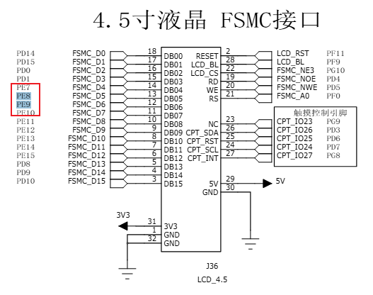
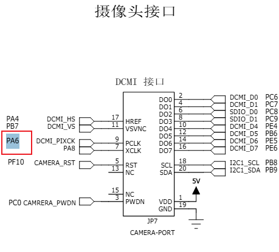

# /*  TIM2的PWM输出和TIM8的输入捕获 测量验证PWM的实验  zat*/

##  \* TIM2 -> PA5 -> PWM

##  \* TIM8 <- PC6 <- input

# /*  TIM1带死区的互补输出PWM & 刹车输入  zat*/

##  \* TIM1 -> PE9 -> CH1 -> PWM

##  \* TIM1 -> PE8 -> CH1N -> PWM

##  \* TIM1 <- PA6 <- BKIN <- input

