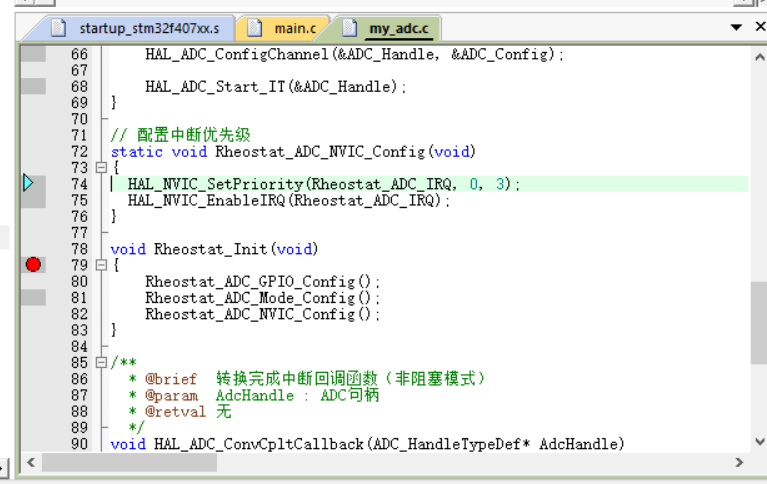
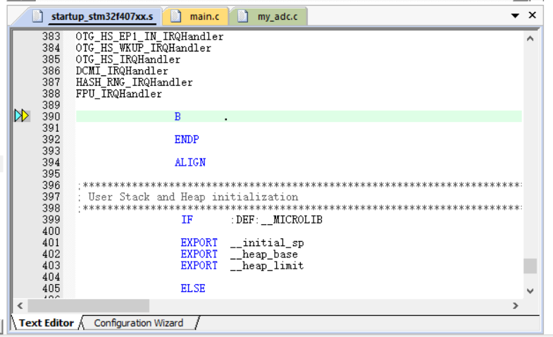

# 中断异常跳转

**User:** Anonymous  
**Created:** 7/25/2026 15:39:21  
**Updated:** 7/25/2026 16:03:56  
**Exported:** 7/25/2026 16:13:23  
**Link:** [https://chatgpt.com/c/6a646828-77d0-83ee-8f65-5be05d37b71e](https://chatgpt.com/c/6a646828-77d0-83ee-8f65-5be05d37b71e)  

# Prompt:
2026/7/25 15:39:17





为什么执行到第一张图箭头所指的这一步之后直接跳到了第二张图

# Response:
2026/7/25 15:39:21

从现象看：

你在 `Rehoestat_ADC_NVIC_Config()` 里面执行：

```c
HAL_NVIC_SetPriority(Rheostat_ADC_IRQ, 0, 3);
```

之后，程序**没有正常往下执行，而是跳到了 startup_stm32f407xx.s 的汇编文件里面**。

这通常说明：**进入了异常处理（HardFault、BusFault、UsageFault 等）**。

第二张图的位置：

```asm
B .
```

是死循环：

```asm
B .
```

等价于：

```c
while(1);
```

也就是说程序进入了某个异常 Handler，然后停在那里。

---

## 最可能原因 1：`Rheostat_ADC_IRQ` 中断号错误

看你的代码：

```c
HAL_NVIC_SetPriority(Rheostat_ADC_IRQ, 0, 3);
HAL_NVIC_EnableIRQ(Rheostat_ADC_IRQ);
```

如果：

```c
#define Rheostat_ADC_IRQ ...
```

定义错了，例如 ADC1 的中断写成了不存在或者错误的 IRQ，就可能异常。

STM32F407 ADC 常见：

ADC1：

```c
ADC_IRQn
```

或者：

```c
ADC_IRQn = 18
```

如果是 ADC1：

一般：

```c
#define Rheostat_ADC_IRQ ADC_IRQn
```

---

## 最可能原因 2：中断函数名字不匹配

你开启了 ADC 中断：

```c
HAL_NVIC_EnableIRQ(Rheostat_ADC_IRQ);
```

但是启动后 ADC 转换完成，会进入：

```
ADC_IRQHandler()
```

然后 HAL 再调用：

```c
HAL_ADC_ConvCpltCallback()
```

所以必须有：

```c
void ADC_IRQHandler(void)
{
    HAL_ADC_IRQHandler(&ADC_Handle);
}
```

如果没有：

- ADC触发中断
- CPU找不到正确入口
- 进入 Default_Handler
- 停在 startup 文件

---

## 检查 startup 文件

第二张图附近：

```asm
OTG_HS_EP1_IN_IRQHandler
OTG_HS_WKUP_IRQHandler
...
FPU_IRQHandler

B .
```

这里其实是：

```asm
Default_Handler PROC

    B .

Default_Handler ENDP
```

说明：

**你的程序进入了默认中断处理函数。**

也就是：

> 某个中断发生了，但是你没有提供对应的中断服务函数。

---

## 最可能的修复

你的 `my_adc.c` 加：

```c
void ADC_IRQHandler(void)
{
    HAL_ADC_IRQHandler(&ADC_Handle);
}
```

注意名字必须和 startup 里面一致。

比如 startup：

```asm
DCD ADC_IRQHandler
```

那 C 文件必须：

```c
void ADC_IRQHandler(void)
```

大小写完全一致。

---

## 另外检查 ADC 初始化顺序

你这里：

```c
void Rheostat_Init(void)
{
    Rheostat_ADC_GPIO_Config();
    Rheostat_ADC_Mode_Config();
    Rheostat_ADC_NVIC_Config();
}
```

如果：

```c
Rheostat_ADC_Mode_Config()
```

里面：

```c
HAL_ADC_Start_IT()
```

已经启动 ADC，那么 ADC 中断可能提前发生。

推荐：

```c
void Rheostat_Init(void)
{
    Rheostat_ADC_GPIO_Config();
    Rheostat_ADC_Mode_Config();
    Rheostat_ADC_NVIC_Config();

    HAL_ADC_Start_IT(&ADC_Handle);
}
```

---

## 调试确认方法

在 `Default_Handler` 上打断点，然后看：

Keil：

```
Debug -> Registers
```

查看：

```
ICSR寄存器
```

里面：

```
VECTACTIVE
```

可以看到到底是哪一个中断进去的。

---

结合你的截图，我判断概率：

1. **ADC_IRQHandler 没写或者名字错误（80%）**
2. **Rheostat_ADC_IRQ 定义错误（15%）**
3. **ADC初始化导致提前触发（5%）**

你可以先搜索工程：

```
ADC_IRQHandler
```

看看有没有这个函数。你这个现象非常像 HAL ADC 中断入口没接上的情况。

# Prompt:
2026/7/25 15:39:40

#include "my_adc.h"

/*  ADC1(独立模式,单通道,中断)测量滑动变阻器电压  zat*/
#if 1

__IO uint16_t ADC_ConvertedValue;
DMA_HandleTypeDef DMA_Init_Handle;
ADC_HandleTypeDef ADC_Handle;
ADC_ChannelConfTypeDef ADC_Config;

static void Rheostat_ADC_GPIO_Config(void)
{
    GPIO_InitTypeDef GPIO_InitStructure;

    // 使能 GPIO 时钟
    RHEOSTAT_ADC_GPIO_CLK_ENABLE();
        
    // 配置 IO
    GPIO_InitStructure.Pin = RHEOSTAT_ADC_GPIO_PIN;
    GPIO_InitStructure.Mode = GPIO_MODE_ANALOG;	    
    GPIO_InitStructure.Pull = GPIO_NOPULL ; //不上拉不下拉
    HAL_GPIO_Init(RHEOSTAT_ADC_GPIO_PORT, &GPIO_InitStructure);		
}

static void Rheostat_ADC_Mode_Config(void)
{

    // 开启ADC时钟
    RHEOSTAT_ADC_CLK_ENABLE();
    // -------------------ADC Init 结构体 参数 初始化------------------------
    // ADC1
    ADC_Handle.Instance = RHEOSTAT_ADC;
    // 时钟为fpclk 4分频	
    ADC_Handle.Init.ClockPrescaler = ADC_CLOCKPRESCALER_PCLK_DIV4;
    // ADC 分辨率
    ADC_Handle.Init.Resolution = ADC_RESOLUTION_12B;
    // 禁止扫描模式，多通道采集才需要	
    ADC_Handle.Init.ScanConvMode = DISABLE; 
    // 连续转换	
    ADC_Handle.Init.ContinuousConvMode = ENABLE;
    // 非连续转换	
    ADC_Handle.Init.DiscontinuousConvMode = DISABLE;
    // 非连续转换个数
    ADC_Handle.Init.NbrOfDiscConversion   = 0;
    //禁止外部边沿触发    
    ADC_Handle.Init.ExternalTrigConvEdge = ADC_EXTERNALTRIGCONVEDGE_NONE;
    //使用软件触发，外部触发不用配置，注释掉即可
    //ADC_Handle.Init.ExternalTrigConv      = ADC_EXTERNALTRIGCONV_T1_CC1;
    //数据右对齐	
    ADC_Handle.Init.DataAlign = ADC_DATAALIGN_RIGHT;
    //转换通道 1个
    ADC_Handle.Init.NbrOfConversion = 1;
    //使能连续转换请求
    ADC_Handle.Init.DMAContinuousRequests = ENABLE;
    //转换完成标志
    ADC_Handle.Init.EOCSelection          = DISABLE;    
    // 初始化ADC	                          
    HAL_ADC_Init(&ADC_Handle);
    //---------------------------------------------------------------------------
    ADC_Config.Channel      = RHEOSTAT_ADC_CHANNEL;
    ADC_Config.Rank         = 1;
    // 采样时间间隔	
    ADC_Config.SamplingTime = ADC_SAMPLETIME_56CYCLES;
    ADC_Config.Offset       = 0;
    // 配置 ADC 通道转换顺序为1，第一个转换，采样时间为3个时钟周期
    HAL_ADC_ConfigChannel(&ADC_Handle, &ADC_Config);
    
    HAL_ADC_Start_IT(&ADC_Handle);
}

// 配置中断优先级
static void Rheostat_ADC_NVIC_Config(void)
{
  HAL_NVIC_SetPriority(Rheostat_ADC_IRQ, 0, 3);
  HAL_NVIC_EnableIRQ(Rheostat_ADC_IRQ);
}

void Rheostat_Init(void)
{
	Rheostat_ADC_GPIO_Config();
	Rheostat_ADC_Mode_Config();
    Rheostat_ADC_NVIC_Config();
}

/**
  * @brief  转换完成中断回调函数（非阻塞模式）
  * @param  AdcHandle : ADC句柄
  * @retval 无
    */
    void HAL_ADC_ConvCpltCallback(ADC_HandleTypeDef* AdcHandle)
    {
    /* 获取结果 */
    ADC_ConvertedValue = HAL_ADC_GetValue(AdcHandle);
    }

#endif

void my_adc_self_test(void){
    // 局部变量，用于保存转换计算后的电压值
    float ADC_Vol; 

    while(1){
        ADC_Vol =(float) ADC_ConvertedValue/4096*(float)3.3; // 读取转换的AD值
        printf("\r\n The current AD value = 0x%04X \r\n", ADC_ConvertedValue); 
        printf("\r\n The current AD value = %f V \r\n",ADC_Vol); 
        delay_ms(100);
    }

}

# Response:
2026/7/25 15:39:44

看你的完整代码，问题基本可以确定了：

**你在 `HAL_ADC_Start_IT(&ADC_Handle);` 后面开启 ADC 中断，但是没有提供 ADC 的 IRQHandler。**

你的流程：

```c
static void Rheostat_ADC_Mode_Config(void)
{
    ...
    HAL_ADC_Init(&ADC_Handle);

    HAL_ADC_ConfigChannel(&ADC_Handle, &ADC_Config);

    HAL_ADC_Start_IT(&ADC_Handle);   //这里已经开启ADC中断
}
```

但是你的代码里面只有：

```c
void HAL_ADC_ConvCpltCallback(ADC_HandleTypeDef* AdcHandle)
{
    ADC_ConvertedValue = HAL_ADC_GetValue(AdcHandle);
}
```

这个只是**回调函数**，不是中断入口。

---

## STM32 HAL ADC中断调用链

实际流程：

```
ADC硬件转换完成
        |
        v
ADC_IRQHandler()
        |
        v
HAL_ADC_IRQHandler()
        |
        v
HAL_ADC_ConvCpltCallback()
```

你的代码缺少第一步：

```c
ADC_IRQHandler()
```

所以 ADC 转换完成后：

```
ADC中断产生
       |
       v
startup里面找到ADC_IRQHandler
       |
       v
没有找到你的函数
       |
       v
Default_Handler
       |
       v
B .
```

也就是你第二张图看到的位置。

---

## 修复

在 `my_adc.c` 加：

```c
void ADC_IRQHandler(void)
{
    HAL_ADC_IRQHandler(&ADC_Handle);
}
```

完整：

```c
void ADC_IRQHandler(void)
{
    HAL_ADC_IRQHandler(&ADC_Handle);
}

void HAL_ADC_ConvCpltCallback(ADC_HandleTypeDef* AdcHandle)
{
    ADC_ConvertedValue = HAL_ADC_GetValue(AdcHandle);
}
```

---

## 但是还有第二个问题

你的初始化顺序：

```c
void Rheostat_Init(void)
{
    Rheostat_ADC_GPIO_Config();
    Rheostat_ADC_Mode_Config();
    Rheostat_ADC_NVIC_Config();
}
```

这里：

```c
HAL_ADC_Start_IT(&ADC_Handle);
```

在 NVIC 开启之前执行。

也就是说：

```
ADC开始转换
       |
       v
转换完成
       |
       v
产生中断
       |
       v
但是NVIC还没打开
```

虽然大多数情况下没事，但是不规范。

建议改：

```c
void Rheostat_Init(void)
{
    Rheostat_ADC_GPIO_Config();
    Rheostat_ADC_Mode_Config();
    Rheostat_ADC_NVIC_Config();

    HAL_ADC_Start_IT(&ADC_Handle);
}
```

然后把 `Rheostat_ADC_Mode_Config()` 里面这一句删除：

```c
HAL_ADC_Start_IT(&ADC_Handle);
```

---

## 另外你的 ADC 配置还有一个小矛盾

你写：

```c
ADC_Handle.Init.DMAContinuousRequests = ENABLE;
```

但是你用的是：

```c
HAL_ADC_Start_IT()
```

也就是：

> 中断模式，不是 DMA 模式。

所以这里应该：

```c
ADC_Handle.Init.DMAContinuousRequests = DISABLE;
```

否则容易让人误解。

---

## 还有一个计算问题

这里：

```c
ADC_Vol =(float) ADC_ConvertedValue/4096*(float)3.3;
```

12位 ADC 最大值是：

```
2^12 - 1 = 4095
```

所以：

```c
ADC_Vol = (float)ADC_ConvertedValue / 4095 * 3.3f;
```

更准确。

---

所以你的主要错误：

✅ `HAL_ADC_ConvCpltCallback()` 有  
❌ `ADC_IRQHandler()` 没有  

加上：

```c
void ADC_IRQHandler(void)
{
    HAL_ADC_IRQHandler(&ADC_Handle);
}
```

基本就不会跳 startup 的 `B .` 了。你这个现象正好是 STM32 HAL ADC 中断最经典的问题。


---
Powered by [ChatGPT Exporter](https://www.chatgptexporter.com)