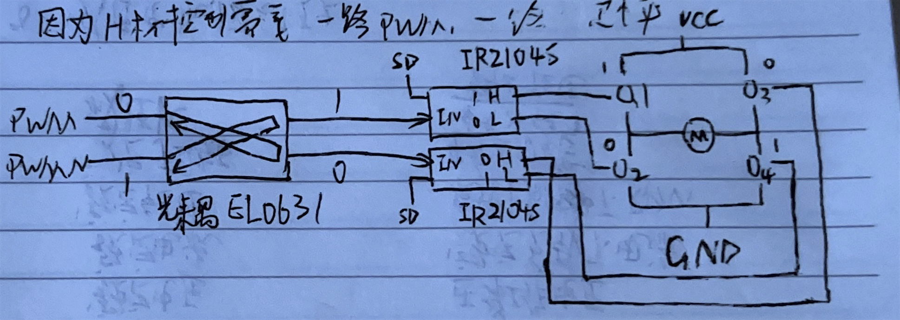
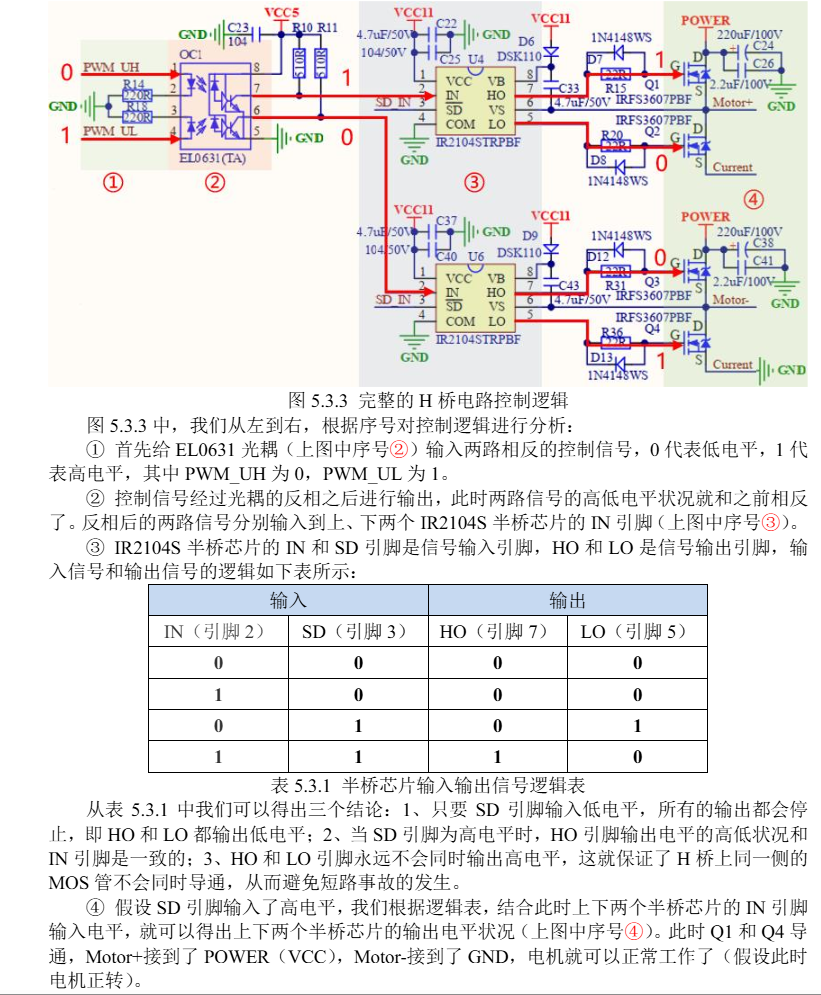
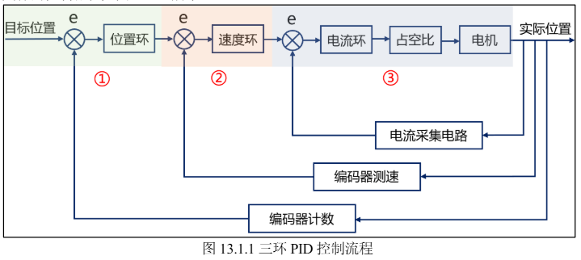

# 🏷️ 第5章 直流有刷电机

### 1. 直流有刷电机基本结构（必问）

##### 直流有刷电机由：

| 结构   | 作用                             |
| ------ | -------------------------------- |
| 定子   | 产生固定磁场                     |
| 转子   | 绕组通电，在磁场中产生力矩       |
| 电刷   | 给转子绕组供电                   |
| 换向器 | 改变转子电流方向，使电机持续旋转 |

> 有刷电机通过电刷和换向器实现机械换向，使转子绕组中的电流方向随着转子位置变化，从而持续产生同方向转矩。

---

##### 工作原理（必问）

左手定则：通电导线在磁场中受到安培力。

### 2. 有刷电机调速原理

实际控制：

STM32输出PWM

↓

驱动板调节平均电压

↓

改变电机转速

重点理解：

PWM不是直接改变电压幅值，而是：

$$
U_{avg}=D\times U_{dc}
$$

其中：

- D：PWM占空比
- Udc：电源电压

---

### 3. H桥驱动原理

这是本章面试最高频知识。

##### 3.1 为什么需要H桥？

电机：

- 加正电压 → 正转
- 加反向电压 → 反转

但是 MCU GPIO不能直接改变电源方向。

所以使用H桥。

---

##### 3.2 H桥结构

四个开关：

```
       VCC
        |
     Q1   Q3
      |   |
      M电机
      |   |
     Q2   Q4
        |
       GND
```

控制：

| 导通  | 方向 |
| ----- | ---- |
| Q1+Q4 | 正转 |
| Q2+Q3 | 反转 |

文档说明：

Q1和Q4导通，电流从a→b；

Q2和Q3导通，电流从b→a。

---

### 4. H桥为什么不能上下管同时导通

经典面试题：

> 为什么H桥需要防止同侧MOS同时导通？

原因：

例如：

Q1和Q2同时导通：

```
VCC
 |
Q1
 |
 |
Q2
 |
GND
```

形成：

VCC → MOS → GND

直接短路。

称：

> 直通现象（Shoot Through）

后果：

- 大电流
- MOS发热
- 驱动损坏

---

### 5. 为什么使用高级定时器PWM互补输出

##### 当CH1关闭❌, CH1N开启✅时, CCR直接控制CH1N, 而CH1持续输出无效电平

```c
/**
* @brief 电机旋转方向设置
* @param para:方向 0 正转，1 反转
* @note 以电机正面，顺时针方向旋转为正转
* @retval 无
*/
void dcmotor_dir(uint8_t para){
	HAL_TIM_PWM_Stop(&g_atimx_cplm_pwm_handle, TIM_CHANNEL_1);
    HAL_TIMEx_PWMN_Stop(&g_atimx_cplm_pwm_handle, TIM_CHANNEL_1);
    
    if(para == 0){ /* 正转 */
     	HAL_TIM_PWM_Start(&g_atimx_cplm_pwm_handle, TIM_CHANNEL_1)
    }else if(para == 1){ /* 反转 */
     	HAL_TIMEx_PWMN_Start(&g_atimx_cplm_pwm_handle, TIM_CHANNEL_1);
	}
}
```

##### 驱动板原理图





H桥控制需要：

- 一路PWM
- 一路固定电平

换向时：

- 主通道固定
- 互补通道输出PWM

正转：

```
TIM1_CH1:
PWM

TIM1_CH1N:
高电平
```

反转：

```
TIM1_CH1:
高电平

TIM1_CH1N:
PWM
```

---

---

### 6. 驱动板中的半桥驱动芯片作用（IR2104）

##### ① 驱动MOS

STM32：

3.3V弱电信号

↓

IR2104

↓

MOS栅极驱动

##### ② 防止上下管同时导通

文档：

IR2104保证：HO和LO不会同时输出高电平。

---

### 7. 电机参数（面试基础）

需要知道：

| 参数     | 含义              |
| -------- | ----------------- |
| 额定电压 | 正常工作电压      |
| 额定电流 | 额定负载下电流    |
| 额定转速 | 负载情况下RPM     |
| 额定扭矩 | 输出力矩          |
| 减速比   | 输入转速/输出转速 |


---

### 8. 减速电机为什么扭矩更大？

功率近似：

$$
P=T\omega
$$

减速：

速度降低：

$$
\omega↓
$$

因此：

$$
T↑
$$

所以：

- 转速下降
- 输出扭矩增加

文档：在输出功率一定时，转速和扭矩成反比例关系。  

# 🏷️ 第6章 直流有刷驱动板电压温度电流采集

### 1. 为什么电压、电流、温度不能直接用 ADC 测量

ADC只能测**电压信号**，而电机系统中的：

- 母线电压可能几十伏
- 电流是电流量，不是电压量
- 温度对应电阻变化

所以需要先通过外围电路转换成 ADC 可测的电压。

本章三个采集链路：

```
实际物理量
      ↓
传感器/转换电路
      ↓
模拟电压
      ↓
ADC采样
      ↓
软件换算
```

---

### 2. 电压检测电路

你至少知道：

```
母线电压
    |
    ↓
电阻分压
    |
    ↓
运放跟随
    |
    ↓
ADC
```

知道：

- 高电压不能直接进ADC
- 分压降低电压
- 运放提高驱动能力
- 软件根据比例恢复实际电压

总结：

> 通过电阻分压将母线电压降低到ADC范围，再经过运放缓冲后送入ADC，软件根据分压比例换算实际电压。

---

### 3. 电流检测电路

需要理解：

```
电机电流
    |
    ↓
采样电阻
    |
    ↓
微小电压
    |
    ↓
差分放大
    |
    ↓
ADC
```

总结：

> 在电机回路串联采样电阻，通过采样电阻将电流转换成微小电压，再经过放大电路提高幅值，最后ADC采样计算得到实际电流。

---

### 4. 多通道 ADC 采集

新增：

一个 ADC 同时采：

| 通道         | 采集 |
| ------------ | ---- |
| ADC1_CH9 PB1 | 电压 |
| ADC1_CH0 PA0 | 温度 |
| ADC1_CH8 PB0 | 电流 |

为什么不用三个ADC？

因为：

- STM32 ADC支持扫描模式
- 多通道可以按顺序采集
- DMA自动搬运数据

---

### 5. ADC + DMA连续采集流程

这是嵌入式面试高频。

流程：

```
ADC启动
 ↓
多通道转换
 ↓
DMA搬运ADC数据
 ↓
DMA完成中断
 ↓
计算平均值滤波
 ↓
重新启动DMA
```

总结：

> ADC负责模拟量转换，DMA负责自动搬运数据，CPU只需要在DMA完成中断中处理结果，可以降低CPU负担，提高采样效率。

---

### 6. 为什么ADC采样要平均滤波

1000次采样求平均：

$$
ADC_{avg}
=
\frac{\sum ADC}{1000}
$$

目的：

- 降低随机噪声
- 提高测量稳定性

实际使用中:

因为电机工作时存在PWM开关噪声、电磁干扰，单次采样波动较大，需要滤波。

---

### 7. 电流采集为什么需要初始参考值

代码中：

启动前读取1000次电流ADC值作为参考。

原因：

电流检测电路存在：

- 运放偏置
- ADC零点误差
- 参考电压误差

所以：

实际电流：

$$
I=(ADC_{now}-ADC_{zero})\times K
$$


# 🏷️ 第7章 直流有刷电机编码器测速

### 1、编码器是什么（必背）

编码器能将直线位移、角位移数据转换为脉冲信号、二进制编码，本质是把机械运动转换成电信号反馈给控制器。

### 2、编码器分类（面试常问）

#### 按检测原理

##### 光电式

利用光信号变化检测位置。

特点：

- 精度高
- 常用于高精度设备

##### 磁电式

利用霍尔效应检测磁场变化。

本实验使用：

> 磁电增量式编码器

---

#### 按编码类型

##### 增量式编码器

输出：

```
脉冲数量
```

特点：

- 上电后不知道绝对位置
- 通过累计脉冲计算位移
- 常用于测速

##### 绝对式编码器

输出：

```
唯一位置编码
```

特点：

- 上电直接知道位置
- 不需要累计

---

### 3、增量式编码器重点（面试核心）

##### A/B两相信号

增量编码器一般输出：

```
A相
B相
```

两个信号相位相差90°。

通过相位关系判断：

- 转向
- 转速

例如：

正转：

```
A:
__----__----__

B:
____----__----
```

反转：

A/B顺序相反。

---

##### 为什么需要两相？

因为单独一个A相：

只能知道：

> 转了多少

不知道：

> 转向

加入B相：

通过：

```
A领先B
```

或者

```
B领先A
```

判断方向。

---

### 4、编码器倍频（重点）

这是面试非常容易问的。

STM32定时器编码器模式可以：

##### 方式1：只检测TI1一个通道

检测：

- A相两个边沿

等效：

2倍频

例如：

编码器：

10线

那么：

```
10 × 2 = 20次计数
```

---

##### 方式2：TI1和TI2都检测

检测：

- A相两个边沿
- B相两个边沿

等效：

4倍频

例如：

10线编码器：

```
10 × 4 = 40次计数
```

文档明确指出：

只检测一个通道相当于2倍频，同时检测两个通道相当于4倍频。

---

### 5、速度计算公式（必须会）

文档给出的核心公式：

$$
电机转速=
\frac{一分钟内计数变化量}
{倍频系数 \times 编码器线数 \times 减速比}
$$

例如：

编码器：

- 11线
- 4倍频
- 减速比30

一分钟计数：

13200

那么：

$$
RPM=
\frac{13200}{4\times11\times30}
$$

---

### 6、STM32怎么读取编码器（重点）

本章新增：

> 使用通用定时器编码器接口

而：

> 高级定时器用于电机PWM驱动。

```
TIM1
 |
PWM输出
 |
H桥
 |
电机

TIM3
 |
编码器模式
 |
读取A/B相
 |
计算速度
```

---

### 7、为什么不用GPIO中断读取编码器？

面试可能问。

错误方案：

```
A相变化
    ↓
GPIO中断
    ↓
软件计数
```

问题：

- 高频脉冲占用CPU
- 容易漏计数
- 实时性差

使用定时器编码器模式：

```
编码器A/B
      ↓
TIMx硬件计数
      ↓
读取CNT
```

优点：

- 硬件自动计数
- CPU压力小
- 精度高

---

### 8、本章代码新增知识点

##### 为什么TIM3 ARR设置65535？

代码：

```
gtim_timx_encoder_chy_init(0XFFFF,0)
```

原因：

TIM3是16位计数器：

范围：

```
0~65535
```

设置最大值：

避免高速旋转时溢出。


---

##### 为什么还需要TIM6？

TIM3：

负责：

```
累计编码器脉冲
```

TIM6：

负责：

```
固定周期读取CNT计算速度
```

例如：

TIM6：

1ms进入一次中断。

然后：

```
当前CNT - 上一次CNT
=
1ms内脉冲数量
```

计算速度。


# 🏷️ 第8章 PID算法

### 1. 开环控制 vs 闭环控制（必问）

##### 开环控制

特点：

- 没有反馈
- 给定输入 → 控制器 → 执行器 → 输出
- 不知道实际输出是否达到目标

例如：

> 给直流电机固定 PWM 占空比，认为它会达到目标速度。

缺点：

- 负载变化时速度变化
- 电机老化、电压变化都会导致误差

文档中的例子：

固定占空比控制电机，如果负载变化，电机速度会偏离目标范围，所以需要引入闭环控制。

---

##### 闭环控制

结构：

```
目标值
  |
  ↓
比较器 ←──── 实际值反馈
  |
  ↓
PID控制器
  |
  ↓
执行器(PWM)
  |
  ↓
电机
  |
  ↓
编码器测速
```

核心：

通过：

```
误差 = 目标值 - 实际值
```

不断调整输出，使实际值逼近目标值。

电机中：

- 目标值：目标转速
- 反馈值：编码器测得转速
- 控制量：PWM占空比

---

### 2. 比例 P

公式：

$$
u=K_p e
$$

其中：

- e：当前误差
- Kp：比例系数
- u：输出

作用：

误差越大，输出越大。

例如：

目标速度：

```
1000RPM
```

实际：

```
500RPM
```

误差：

```
500
```

P会输出较大的PWM。

优点：

- 响应快

缺点：

- 存在稳态误差

例如：

PWM增加后速度提高：

```
目标1000

实际950

误差50
```

因为还有误差，所以会一直存在偏差。

---

### 3. 积分 I

作用：

累计历史误差。

公式：

$$
u=K_i\sum e
$$

作用：

消除稳态误差。

例如：

```
目标1000RPM

实际950RPM

误差50
```

P只能给固定输出。

但是积分：

```
50+50+50+50...
```

不断增加输出，让速度继续提高。

缺点：

容易产生：

##### 积分饱和

例如：

电机最大速度：

```
300RPM
```

目标：

```
350RPM
```

系统永远达不到目标。

积分不断累计：

```
误差越来越大
↓
积分越来越大
↓
输出越来越大
```

之后突然目标变成：

```
200RPM
```

由于积分还很大：

```
输出仍然很大
```

导致响应慢。

文档提出解决：

1. 优化PID曲线
2. 限制目标值范围
3. 积分限幅


---

### 4. 微分 D

作用：

预测误差变化趋势。

公式：

$$
u=K_d(e_k-e_{k-1})
$$

例如：

误差变化：

```
昨天：
100

今天：
20
```

说明：

误差快速减小。

微分判断：

未来可能超调。

所以：

降低输出。

作用：

- 抑制超调
- 减小振荡

文档总结：

微分环节根据偏差变化量提前控制，减小超调。

---

### 5. PID完整公式（必须会）

连续PID不适合单片机计算，所以实际使用离散PID。

位置式PID：

$$
u_k
=
K_pe_k
+
K_i\sum e_j
+
K_d(e_k-e_{k-1})
$$

参数：

| 符号 | 含义       |
| ---- | ---------- |
| u    | 输出       |
| Kp   | 比例系数   |
| Ki   | 积分系数   |
| Kd   | 微分系数   |
| ek   | 当前误差   |
| ek-1 | 上一次误差 |

增量式PID:
$$
\delta u_{k}=K_{p}\left(e_{k}-e_{k-1}\right)+K_{i}\cdot e_{k}+K_{d}\left(e_{k}-2e_{k-1}+e_{k-2}\right)
$$


---

### 6. 位置式PID vs 增量式PID（面试高频）

##### 位置式PID

输出：

$$
u_k
$$

也就是：

直接计算当前PWM。

特点：

需要：

- 当前误差
- 历史累计误差

优点：

- 有积分作用
- 控制精度高

缺点：

- 计算量大
- 积分容易饱和

---

##### 增量式PID

输出：

$$
\Delta u_k
$$

也就是：

这一次PWM增加多少。

例如：

当前：

```
PWM=50%
```

PID计算：

```
增加5%
```

输出：

```
PWM=55%
```

特点：

只需要：

```
最近几次误差
```

优点：

- 运算量小
- 错误影响小
- 实时性好

缺点：

- 有稳态误差

##### 文档总结：

|      | 位置式        | 增量式       |
| ---- | ------------- | ------------ |
| 输出 | 全量          | 增量         |
| 偏差 | 一直累计      | 最近3次      |
| 积分 | 有            | 无           |
| 限幅 | 输出+积分限幅 | 只需输出限幅 |


---

### 7. PID代码实现思想（面试结合项目）

代码核心不是公式，而是数据管理。

##### PID结构体：

```c
typedef struct
{
    float SetPoint;      //目标值
    float ActualValue;   //输出值
    float SumError;      //累计误差

    float Proportion;    //Kp
    float Integral;      //Ki
    float Derivative;    //Kd

    float Error;         //当前误差
    float LastError;     //上一次误差
    float PrevError;     //上上次误差

} PID_TypeDef;
```

文档说明通过结构体保存：

- 目标值
- 实际值
- PID参数
- 历史误差

方便计算PID。

##### PID 算法代码:

```c
int32_t increment_pid_ctrl(PID_TypeDef *PID,float Feedback_value)
{
    PID->Error = (float)(PID->SetPoint - Feedback_value); /* 计算偏差 */
    PID->SumError += PID->Error; /* 累计偏差 */
    PID->ActualValue = (PID->Proportion * PID->Error) /* 比例环节 */
                    + (PID->Integral * PID->SumError) /* 积分环节 */
                    + (PID->Derivative * (PID->Error - PID->LastError)); /* 微分环节 */
    PID->LastError = PID->Error; /* 存储偏差，用于下次计算 */
    return ((int32_t)(PID->ActualValue)); /* 返回计算后输出的数值 */
}
```


---

### 6. 电机速度闭环完整流程（面试综合题）

这是这一章最重要的项目理解。

流程：

```
设置目标速度
       |
       ↓
编码器测速
       |
       ↓
计算误差

误差=目标速度-实际速度

       |
       ↓
PID计算

       |
       ↓
输出PWM占空比

       |
       ↓
H桥驱动电机

       |
       ↓
速度变化

       |
       ↓
编码器再次反馈
```

##### 总结:

电机速度闭环控制通过编码器采集实际转速，与目标速度比较得到误差，然后经过PID算法计算PWM调整量，使电机速度稳定在目标值附近。

# 🏷️ 第9章 PID参数整定

### 1. PID采样周期选择 

采样周期越短：

- 越接近连续控制效果
- 响应速度更快

但是：

- CPU占用增加
- ADC采样、编码器读取、PID计算频率增加
- 资源消耗提高

所以需要根据控制对象选择合适周期。

##### （1）理论方法：香农采样定理

作用：

确定最大允许采样周期。

如果采样频率过低：

- 采样信号会失真
- 无法恢复原信号


---

##### （2）工程方法：根据对象变化速度选择 

例如：

电机：

当前速度：

20RPM

目标：

30RPM

1秒最大变化：

10RPM

如果：

采样周期 = 1ms

那么一次采样最大变化：

$$
\frac{10RPM}{1000}=0.01RPM
$$

变化太小：

- PID看到的误差变化很小
- 控制效果提升有限
- 但占用大量资源

所以：

采样周期应该匹配控制对象的变化能力。


---

### 2. P、I、D参数分别影响什么 

面试高频。

##### Kp（比例）

作用：

看到误差立即输出。

特点：

增大Kp：

优点：

- 响应快
- 调节速度提高

缺点：

- 容易振荡
- 超调增加


---

##### Ki（积分）

作用：

消除静态误差。

增大Ki：

优点：

- 消除误差更快

缺点：

- 容易产生超调

尤其对于有惯性的系统明显。


---

##### Kd（微分）

作用：

预测误差变化趋势。

增大Kd：

优点：

- 提前响应
- 抑制超调

缺点：

- 太大会导致振荡


---

### 3. 试凑法 

实际工程最常用。

步骤：

##### 第一步

只调P：

关闭：

$$
Ki=0
$$

$$
Kd=0
$$

逐渐增加Kp。

观察：

- 响应速度
- 是否振荡

---

##### 第二步

加入I：

逐渐增加Ki。

目的：

消除静差。

---

##### 第三步

加入D：

如果：

- 有小幅超调
- PI无法优化

增加Kd。


---

面试回答：

> PID调参一般先调比例环节，使系统达到较快响应，再加入积分消除静差，最后根据超调和振荡情况调整微分。

---

### 4. 临界比例法 

核心思想：

找到系统临界振荡状态。

步骤：

##### 1.

设置：

$$
Ki=0
$$

$$
Kd=0
$$

只使用比例控制。

##### 2.

不断增加Kp。

观察：

- 衰减振荡 → 继续增加
- 发散振荡 → 减小

直到：

等幅振荡。

记录：

- 临界比例系数 $K_\delta$
- 临界振荡周期 $T_k$

然后利用经验公式计算PID参数。


---

### 5. 一般调节法 

更偏工程经验。

流程：

##### 第一步

关闭：

$$
Ki=Kd=0
$$

调节Kp：

直到出现振荡。

降低到：

60%~70%。

---

##### 第二步

增加Ki：

直到振荡。

降低到：

55%~65%。

---

##### 第三步

Kd：

通常不用。

如果PI无法解决小振荡：

再加入D。

# 🏷️ 第10章 直流有刷电机速度环控制实现

### 1. 什么是速度环 PID 控制（重点）

### 核心概念

##### 速度环就是：

闭环控制，通过编码器采集实际速度，与目标速度比较产生误差，再经过PID计算输出PWM控制量，实现速度稳定跟踪。

##### 控制流程：

```
目标速度
   ↓
计算速度误差 e
   ↓
PID控制器
   ↓
输出PWM占空比
   ↓
电机
   ↓
编码器测速
   ↓
反馈实际速度
```

##### 作用:

基础PWM控制属于开环，只能控制输入电压，无法知道实际速度。当负载变化时速度会偏移，因此加入编码器反馈，通过PID自动调整PWM。

### 2. 速度环PID输出是什么？（重点）

很多新人容易答错。

速度环PID输出：

不是速度。

不是电压。

而是：

> PWM占空比控制量。

关系：

```
速度误差
    ↓
 PID
    ↓
 PWM占空比
    ↓
 电机电压
    ↓
 电机速度
```

面试：

> PID输出控制什么？

回答：

> 速度环PID输出的是电机驱动PWM占空比，通过改变平均电压控制电机转速。

### 3. 总结

1. **速度环PID是通过编码器反馈实现电机速度闭环控制。**
2. **速度环PID输出的是PWM占空比，不是速度。**
3. **PID必须固定采样周期，否则积分和微分计算会失效。**
4. **控制算法一般放在定时器中断中保证实时性。**
5. **速度环本质是利用反馈不断修正PWM，使实际速度跟踪目标速度。**


# 🏷️ 第11章 电流环 PID 控制

### 1. 电流环 PID 的基本概念 

流程：

> 目标电流 → PID → PWM → 电机电流

电流环本质也是一个闭环控制，通过采样电机实际电流，与目标电流比较产生误差，再经过 PID 调节 PWM 占空比，使电机电流快速跟踪目标值。

---

### 2. 为什么需要电流环 

这是面试常问。

因为：

电机产生的转矩：

$$
T=K_t I
$$

电流直接决定电机输出转矩。

所以控制电流实际上就是控制：

- 输出力矩
- 加速度
- 抗负载能力

例如：

负载突然增加：

没有电流环：

PWM固定 → 电流下降 → 转矩下降 → 电机掉速

有电流环：

检测到电流偏差：

$$
目标电流 > 实际电流
$$

PID增加PWM：

电流恢复 → 转矩恢复

---

### 3. 电流环为什么响应速度比速度环快 

这是重点。

原因：

电流变化快：

电机绕组电感、电阻决定电流响应。

速度变化慢：

速度受到：

- 转动惯量
- 负载
- 摩擦

影响。

所以典型控制结构：

```
位置环
 ↓
速度环
 ↓
电流环
 ↓
PWM
 ↓
电机
```

越靠内：

响应越快。

---

### 4. 电流环中的滤波 

文档下载验证中特别提到：

电流环波形出现小幅振荡属于正常现象。

改善：

- 调整PID参数
- 增大滤波次数

但是：

滤波次数越多：

优点：

- 波形更稳定

缺点：

- 响应速度降低

所以需要在：

> 稳定性和响应速度之间折中。


面试回答：

> 电流采样容易受到PWM纹波影响，因此通常需要滤波，但滤波会增加延迟，所以需要根据系统响应要求选择合适滤波强度。

---

### 5. 电流环采样周期 

电流环特点：

- 高频
- 快速响应

所以采样周期通常：

$$
T_{current}<T_{speed}
$$

也就是：

电流环频率 > 速度环频率

典型：

```
电流环：10kHz
速度环：1kHz
位置环：100Hz
```

（这个频率层级属于电机控制常用经验，文档本章主要强调电流环快速响应。）


# 🏷️ 第12章 位置环PID控制

系统通过编码器获取电机当前位置，将编码器累计计数值作为位置反馈，与目标位置比较得到误差，然后经过位置PID计算输出PWM占空比控制电机运动，使实际位置逐渐跟踪目标位置。PID计算放在定时器周期中断中执行。


# 🏷️ 第13章 直流有刷电机三环控制

### 1. 什么是三环PID控制（重点）

##### 三环PID概念：

> 位置环 + 速度环 + 电流环 三个PID控制器串联。

三个环不是并列关系，而是**外环给内环提供目标值**。

##### 控制关系：

```
目标位置
    ↓
位置环 PID
    ↓
目标速度
    ↓
速度环 PID
    ↓
目标电流
    ↓
电流环 PID
    ↓
PWM占空比
    ↓
电机
```

1. 设置目标位置，计算位置偏差，进入位置环；
2. 位置环输出与实际速度比较，进入速度环；
3. 速度环输出与实际电流比较，进入电流环；
4. 电流环输出控制PWM占空比，最终控制位置。

---

##### 结构:



##### 总结:

> 单独的位置环响应速度较慢，而且抗负载能力差。加入速度环可以保证运动速度稳定，加入电流环可以快速控制电机输出力矩，提高系统动态响应和抗扰能力。所以通过位置环、速度环、电流环形成串级控制，可以同时满足位置精度、速度稳定性以及力矩控制需求。

---

### 2. 三个环分别控制什么？

这是最容易问的。

| 环     | 控制目标         | 输入              | 输出     |
| ------ | ---------------- | ----------------- | -------- |
| 位置环 | 电机转到目标位置 | 目标位置-实际位置 | 目标速度 |
| 速度环 | 保持目标速度     | 目标速度-实际速度 | 目标电流 |
| 电流环 | 控制电机力矩     | 目标电流-实际电流 | PWM      |

---

### 3. 为什么电流环放在最里面？

这是三环控制非常经典的问题。

原因：

##### 电流决定力矩

直流电机：

$$
T=K_t I
$$

电流越大，输出力矩越大。

所以：

- 电流变化最快；
- 力矩响应最快；
- 可以直接抑制负载扰动。

例如：

电机突然加负载：

```
负载增加
 ↓
速度下降
 ↓
速度环发现速度误差
 ↓
提高目标电流
 ↓
电流环快速增加PWM
 ↓
输出更大力矩
 ↓
恢复速度
```

因此电流环必须靠近执行器。

---

### 4. 为什么外环慢，内环快？

三环控制的重要原则：

> 内环采样频率高，外环采样频率低。

原因：

内环控制对象变化快：

```
电流 → PWM → 电机力矩
```

响应非常快。

外环：

```
位置变化
```

机械运动惯性大，变化慢。

所以通常：

```
电流环频率最高

速度环其次

位置环最低
```

---

### 5. 三环控制中的限幅（新增工程知识）

第13章程序里面加入了：

- PID积分限幅
- 输出限幅
- 闭环死区

例如：

位置误差进入死区：

```
误差 < 某范围

认为已经到达目标

清除累计误差

停止PID调节
```

这样可以避免：

- 小误差导致电机不停抖动；
- 积分不断累积。

文档指出：

> 当系统偏差进入死区范围时，让偏差等于0，并清除累计偏差，可以避免小幅度偏差导致的位置抖动。

---

### 6. 三环PID和单环PID区别

面试可能问：

Q：为什么不用一个位置PID？

回答：

单位置环：

```
位置误差
 ↓
PWM
 ↓
电机
```

问题：

- 负载变化影响明显；
- 响应速度慢；
- 无法直接控制力矩。

三环：

```
位置控制精度
+
速度稳定性
+
电流快速响应
```

性能更好。


# 🏷️ 