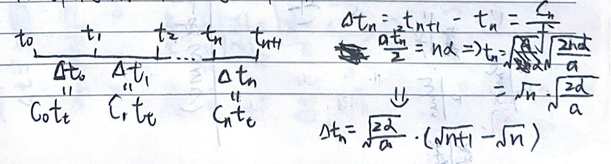
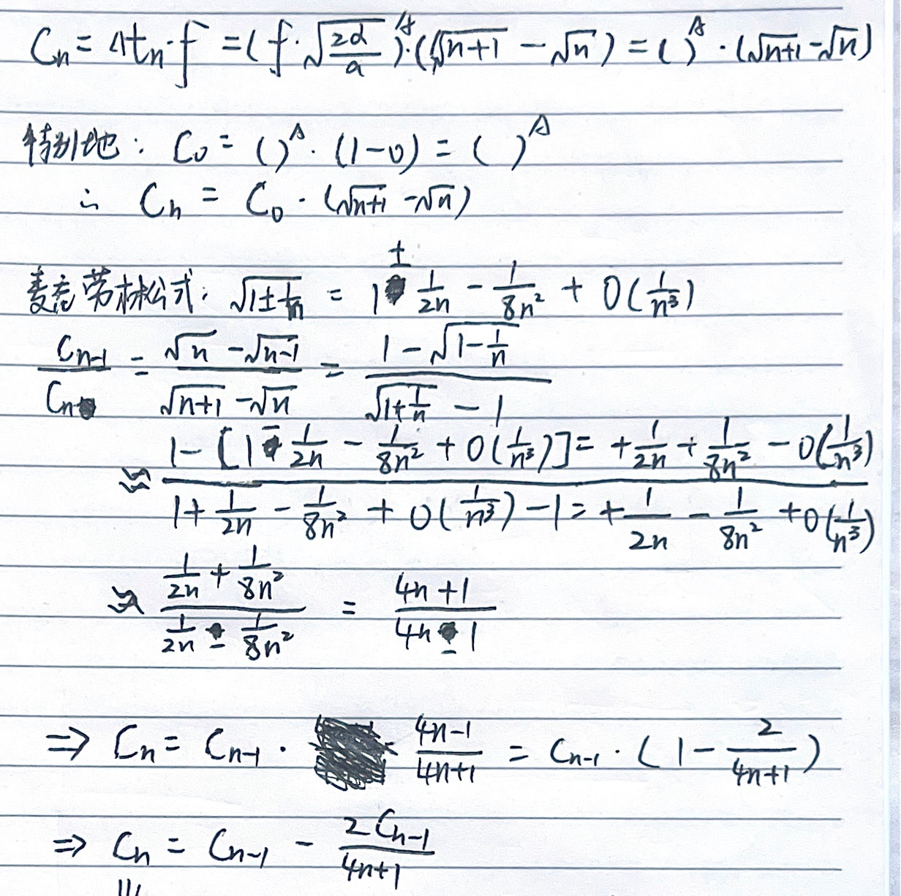
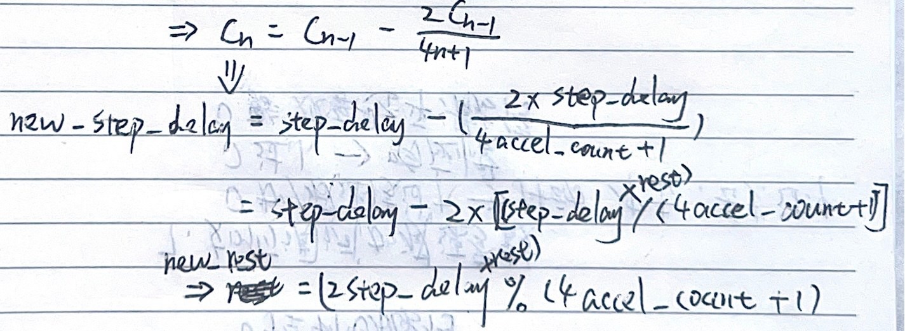

# 🏷️ 第 15 章 步进电机

### 1. **步进电机的基本工作原理**

- 步进电机是将**电脉冲信号**转换为**角位移或线位移**的电动机。
- 每输入一个脉冲，转子转动一个固定角度（步距角）。
- 旋转角度与脉冲数成正比，转速与脉冲频率成正比。

### 2. **步进电机的`5`种类型**

| 类型             | 特点                                                     |
| :--------------- | :------------------------------------------------------- |
| 永磁式           | 动态性能好，力矩大，但步距角大（7.5°或15°）              |
| 反应式（磁阻式） | 结构简单，成本低，步距角小（可达1.2°），但噪声大、动态差 |
| 混合式           | 综合前两者优点，力矩大、精度高、步距角小，应用最广       |
| **单极性**       | 电流单向，有公共端，驱动简单，但力矩小。                 |
| **双极性**       | 电流双向，无公共端，力矩大，驱动复杂。                   |

### 3. 驱动方式与细分

3.1 **整步、半步驱动**

- **整步**：每步一个步距角（如90°）。
- **半步**：每步为整步的一半（如45°），运行更平滑。

3.2 **细分驱动原理**

- 通过**改变定子电流比例**，控制转子在整步内的不同位置。
- 细分可将一个整步分成多个小步（如32、64、256细分）。
- 优点：**提高平滑度、精度，减少振动和噪声**。

### 4. **驱动器的作用**

- 将控制器的脉冲信号**功率放大**，驱动步进电机。
- 支持**细分、电流调节、过流/过热保护**。

**拨码开关设置**

- **细分设置**（SW1~SW4）：决定每圈脉冲数。
- **电流设置**（SW5~SW8）：决定输出电流大小。
- 注意：**运行时禁止更改拨码开关**。

> 因为驱动器带电时改变开关状态，会导致PWM参数突变，可能烧MOS管或电机。

### 5. 接线方式（常考实操）

- **共阳极**：信号负端接地，正端接信号。
- **共阴极**：信号正端接电源，负端接信号。
- 实验中常用**共阳极接法**。

### 6. **定时器PWM模式驱动步进电机**

- 使用定时器的**PWM输出**产生脉冲。
- 配置步骤：
  1. 开启TIMx和GPIO时钟
  2. 初始化TIMx（ARR、PSC）
  3. 配置PWM模式、极性、比较值
  4. 初始化方向/使能引脚
  5. 启动PWM输出

### 7. **输出比较翻转模式驱动步进电机**

- 每次比较匹配时**翻转电平**，产生脉冲。
- 需在中断中**不断更新比较值**。
- 优点：**脉冲频率可灵活调整**。

### 8. **定位控制原理**

- 通过**控制脉冲个数**实现精确角度控制。

- 8细分下，1.8°步距角 → 0.225°/微步，一圈需1600个脉冲。

- $$
  \underline{\mathbf{微步=\frac{步距角}{细分}}}
  $$

- $$
  \underline{\mathbf{脉冲数=\frac{目标角度}{微步}}}
  $$

# 🏷️ 第 16 章 步进电机梯形加减速

### 1. 梯形加减速的核心概念

- **定义**：步进电机速度变化分为加速段、匀速段、减速段，速度-时间图像呈梯形。
- **目的**：
  - 避免**失步**（启动频率过高）和**过冲**（停止时速度过快）。
  - 实现**快速、平稳、准确定位**。

### 2. 梯形加减速的三大阶段

| 阶段   | 速度变化              | 脉冲频率变化 |
| :----- | :-------------------- | :----------- |
| 加速段 | 从启动速度 → 最大速度 | 频率逐步升高 |
| 匀速段 | 保持最大速度          | 频率恒定     |
| 减速段 | 从最大速度 → 0        | 频率逐步降低 |

### 3. 计算加速段`n_acc`/减速段`n_dec`脉冲数📐

已知: 总步数`N`, 步距角`α`, 加速度`a`, 减速度`d`, 用户设定最大速度`ω_max`.
$$
n_{acc}=N\cdot\frac{d}{a+d}=\frac{\omega_{\max}^2}{2a\alpha}
$$

##### 梯形

$$
如果N\cdot\frac{d}{a+d}>\frac{\omega_{\max}^2}{2a\alpha}\Rightarrow梯形\\\Rightarrow n_{acc}=\frac{\omega_{\max}^2}{2a\alpha},n_{dec}=\frac{\omega_{\max}^2}{2d\alpha};
$$

##### 三角形

$$
如果N\cdot\frac{d}{a+d}<\frac{\omega_{\max}^2}{2a\alpha}\Rightarrow三角形\\\Rightarrow实际达到的最大速度\omega_{peak}=\sqrt{\frac{2adN\alpha}{a+d}},\\n_{acc}=\frac{dN}{a+d},n_{dec}=\frac{aN}{a+d}.
$$

### 4. 计算每个脉冲的定时器计数值`C_n`📐

##### 脉冲间隔`Δt_n`

##### 麦克劳林公式

##### 代码实现

