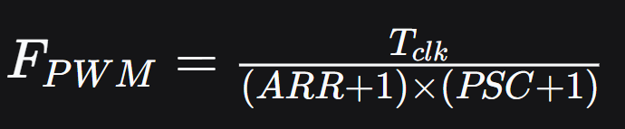
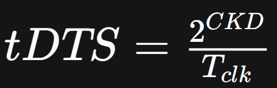

# **4.2 基本定时器**

### 1. 定时器中断的核心机制（必问）

- **时基单元三要素**：`PSC`（预分频器）、`ARR`（自动重载寄存器）、`CNT`（计数器）。

- **溢出时间计算公式**（面试高频）：
  $$
  T_{out} = \frac{(ARR + 1) \times (PSC + 1)}{T_{clk}}
  $$

  - 能说清楚每个变量的含义和单位。
  - 能举例：170MHz 时钟，`PSC=16999`，`ARR=4999`，溢出时间 = 500ms。

------

### 2. 更新事件（Update Event）的产生方式

- **硬件产生**：`CNT == ARR` 时溢出。
- **软件产生**：置位 `UG` 位（`TIMx_EGR` 寄存器）。
- **中断触发条件**：`UIE` 位使能（`TIMx_DIER` 的 bit 0）。

------

### 3. 中断处理流程（HAL 库视角）

- **初始化流程**：
  1. 使能时钟（`__HAL_RCC_TIMx_CLK_ENABLE()`）
  2. 填充 `TIM_HandleTypeDef`
  3. 调用 `HAL_TIM_Base_Init()`
  4. 调用 `HAL_TIM_Base_Start_IT()`
- **中断回调**：
  - `HAL_TIM_IRQHandler()` → 调用 `HAL_TIM_PeriodElapsedCallback()`
- **面试常问**：
  - 为什么要清除中断标志位？
  - 回调函数里为什么要判断 `Instance`？

# 4.3.2 高级定时器中断

## 1、高级定时器（TIM1/8） vs 基本定时器（TIM6/7）的核心差异（必问）

| 对比项          | 基本定时器（TIM6/7） | 高级定时器（TIM1/8/20）     |
| :-------------- | :------------------- | :-------------------------- |
| 计数模式        | 仅递增               | 递增、递减、中心对齐        |
| 重复计数器      | 无                   | 有（RCR）                   |
| 互补输出 / 死区 | 无                   | 有                          |
| 刹车功能        | 无                   | 有                          |
| 编码器接口      | 无                   | 有                          |
| 时钟源          | 仅内部               | 内部 / 外部引脚 / ETR / ITR |

## 2、通用定时器 (TIM 2~5 )

**通用定时器 = 基本定时器（时基单元） + 输入捕获 + 输出比较（PWM）**
**高级定时器 = 通用定时器 + 互补输出 + 死区控制 + 刹车功能 + 重复计数器**

## 3、高级定时器的计数模式（新增概念）

- **三种模式**：
  1. **递增计数**（同基本定时器）
  2. **递减计数**
  3. **中心对齐模式**（向上计数到 ARR 溢出，再向下计数到 0 溢出）
- **更新事件发生条件**（面试重点）：
  - 递增：`CNT == ARR`
  - 递减：`CNT == 0`
  - 中心对齐：在 ARR 和 0 两个位置都产生更新事件

> **面试常问**：中心对齐模式适合什么场景？
> **答**：适合需要对称 PWM 或对相位要求较高的电机控制场景。

## 4、重复计数器（RCR）—— 高级定时器独有

- **作用**：不是每次溢出都产生更新事件，而是每 `RCR + 1` 次溢出才产生一次更新事件。
- **寄存器**：`TIMx_RCR`（16 位，有影子寄存器）
- **典型应用**：输出指定个数 PWM（4.3.8 会深入）

> **面试常问**：RCR = 3 时，几个溢出周期产生一次更新事件？
> **答**：4 次。

# 4.3.3 高级定时器 PWM 输出

### 1. PWM 生成核心原理（必问，且要能画图解释）

- **PWM 生成机制**：计数器 `CNT` 与捕获/比较寄存器 `CCR` 比较，决定输出高低电平。

- **关键公式**（面试手撕）：

  - **频率**：

    

    

  - **占空比**：
    $$
    Duty = \frac{高电平时间} {ARR + 1}
    $$
    

- **面试追问**：ARR 和 CCR 分别决定什么？（ARR 决定周期/频率，CCR 决定占空比）

### 2. PWM 模式 1 vs 模式 2（高频考点）

| 模式       | 有效电平行为               | 典型用途          |
| :--------- | :------------------------- | :---------------- |
| PWM 模式 1 | `CNT < CCR` 时输出有效电平 | 常用，便于理解    |
| PWM 模式 2 | `CNT < CCR` 时输出无效电平 | 与模式 1 极性相反 |

- **面试常问**：这两种模式本质区别是什么？（有效电平定义相反，配合极性位可实现相同波形）

### 3. 输出极性与有效电平（容易混淆）

- **`OCPolarity`**（输出极性）：
  - `HIGH`：CCR 比较匹配时输出高电平
  - `LOW`：CCR 比较匹配时输出低电平
- **面试陷阱**：改变极性会影响占空比的定义，但**实际波形占空比由 CCR/ARR 和极性共同决定**。

### 4. 不同配置下的高电平时间

| 配置           | 高电平时间  | 软件占空比公式          |
| :------------- | :---------- | :---------------------- |
| 模式1 + 极性高 | CCR         | CCR / (ARR+1)           |
| 模式1 + 极性低 | ARR+1 - CCR | (ARR+1 - CCR) / (ARR+1) |
| 模式2 + 极性高 | ARR+1 - CCR | (ARR+1 - CCR) / (ARR+1) |
| 模式2 + 极性低 | CCR         | CCR / (ARR+1)           |

你会发现：**模式1 + 极性高 = 模式2 + 极性低**（波形完全一样）

# **4.3.4 高级定时器互补输出带死区刹车控制**

## 1、核心概念理解（必问）

1. 什么是互补输出（Complementary Output）？

- **定义**：同一通道的两路输出（OCx 和 OCxN），电平**始终相反**（一路高，另一路低）。
- **应用场景**：驱动 H 桥的上下桥臂。

2. 为什么需要死区时间（Dead Time）？

- **根本原因**：功率器件（MOSFET/IGBT）存在**开关延迟**，关断比导通慢。
- **后果**：如果互补信号直接切换，上下桥臂会**同时导通** → 短路 → 烧毁器件。
- **解决方法**：插入一段**两者都为无效电平**的时间（死区），让上管完全关断后再打开下管。

------

## 2、死区时间计算（高频考点）

1. 影响死区时间的两个寄存器位

| 寄存器      | 位         | 作用                            |
| :---------- | :--------- | :------------------------------ |
| `TIMx_CR1`  | `CKD[1:0]` | 定义 `tDTS`（死区采样时钟周期） |
| `TIMx_BDTR` | `DTG[7:0]` | 定义死区时间长度（分 4 段公式） |

2. 计算流程（三步走）

   1. **求 tDTS**：      例：170MHz, CKD=2 → tDTS ≈ 23.53ns
   2. **看 DTG[7:5] 选择公式段**（共 4 段）
   3. **代入计算 DT**

3. **死区时间测量方法**：

   

------

## 3、刹车（Break）功能（加分项）

1. 刹车的作用

- **紧急停止**：当检测到故障（过流、过温、短路）时，**硬件异步**强制关闭 PWM 输出。
- **引脚**：`TIMx_BKIN`（如 PB12）

2. 刹车发生后发生什么？

- OCx/OCxN 输出被强制为**无效/空闲状态**（由 OSSI 位决定）
- 产生刹车中断和 DMA 请求（可选）

3. 刹车验证：

- 将 BKIN 引脚接 GND（低电平有效），观察 PWM 是否立即消失。